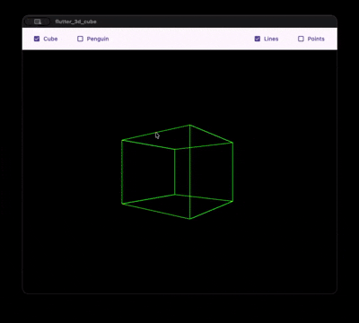

# Flutter 3d Polygons ✅

> Project demonstrating a simple 3D engine written in Flutter using only mathematical calculations and Flutter's `Canvas` rendering.

---

## 📋 Preview



---

## 🔧 What this project is

This project demonstrates how to build basic 3D models (for example, a cube and a penguin) using only:
- Basic linear algebra (vectors, matrices, perspective projection);
- Geometric operations to transform vertices and polygons;
- Flutter's drawing primitives (`CustomPainter` and `Canvas`).

The goal is educational: to prove that you can create 3D scenes without external engines, relying only on Flutter and numeric computations.

---

## 📂 Main code structure

- `lib/vector.dart` — vector operations (add, subtract, normalize, dot product).
- `lib/polygons/polygon.dart` — polygon representation and utilities (normalization, centroid calculation).
- `lib/polygons/cube.dart` and `lib/polygons/penguin.dart` — 3D meshes defined as lists of polygons.
- `lib/render.dart` — projection functions, world → camera → screen transformations and drawing via `Canvas`.
- `lib/render_controller.dart` — scene/camera update controller and input handling.
- `lib/main.dart` and `lib/board.dart` — widget setup containing `CustomPaint` and the render loop.

> Tip: check comments in the code to see implementation choices (e.g., transformation order, shading options, depth sorting strategy).

---

## 🎯 Rendering strategies and controls

The project uses several techniques to produce correct and efficient rendering:

1. Perspective projection
   - 3D vertices are transformed to camera space and projected using a perspective factor that depends on Z distance.

2. Backface culling
   - Polygons whose normal points away from the camera are discarded before rasterization to reduce work.

3. Depth sorting (Painter's algorithm)
   - Polygons are sorted by their average depth (Z) before drawing to handle simple overlap without a Z-buffer.

4. Transformation caching
   - Transformation matrices are computed per frame, while local vertex positions remain immutable; only apply necessary per-frame transforms.

5. Allocation minimization
   - Reuse temporary objects to reduce GC pressure (avoid creating lists/vectors per vertex when possible).

6. Draw call reduction
   - Group polygon paths and draw with `Canvas.drawPath` instead of many scattered `drawLine` calls.

7. Fine-grained update control
   - `RenderController` governs when the screen needs repainting (only when there are changes), avoiding unnecessary renders.

---

## 🚀 Performance notes

- Complexity: each frame iterates through all active vertices and polygons (O(V + P)). For simple models (tens to a few hundred polygons) this is fast on modern devices.
- Common bottlenecks:
  - Trigonometric and matrix computations per vertex (can become CPU heavy for larger scenes).
  - Depth sorting on large lists can be costly (O(n log n)).
- Possible optimizations:
  - Use `RepaintBoundary` to isolate static parts of the widget tree.
  - Precompute transforms when possible (e.g., keyframed animations).
  - Offload heavy work to `Isolate`s (physics/mesh processing) to avoid UI jank.
  - Reduce anti-aliasing when performance is critical.

Recommended profiling: use Flutter's `--profile` mode and DevTools (CPU/Timeline) to find hot spots.

---

## 🧪 How to clone and run

1. Clone the repository:

```bash
git clone https://github.com/ayusuke7/flutter_3d_polygons.git
cd flutter_3d_cube
```

2. Install dependencies:

```bash
flutter pub get
```

3. Run on a device/emulator:

- Android / iOS / macOS / Windows / Linux:

```bash
flutter run
```

> Note: for macOS and iOS ensure you have the appropriate dev tools installed (Xcode, CocoaPods, etc.).

---

## 📄 License

Distributed under the MIT license — see `LICENSE` if included.

---